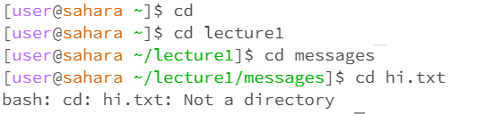
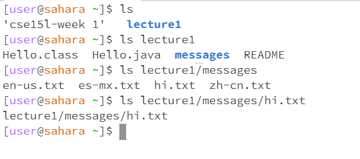

# LAB REPORT 1 

## CD COMMAND:

------- 1. Using cd with no arguments --------

* Command: cd

* Working Directory: cse15l-week 1

* Explanation: Running cd with no arguments does not change the current working directory, so it remains as cse15l-week 1.

--------2. Using cd with a path to a directory as an argument--------

* Command: cd lecture1

* Working Directory: lecture 1 

* Explanation: This command changes the current working directory to lecture1.

-------- 3. Using cd with a path to a file as an argument (error) --------

* Command: cd lecture1/messages/hi.txt

* Working Directory: messages

* Explanation: This is an error because cd is used to change directories, not open files. It's not possible to change the working directory to a file.

## lS COMMAND:

-------- 1. Using ls with no arguments --------

* Command: ls

* Working Directory: cse15l-week 1

* Explanation: This command lists the files and directories in the current working directory cse15l-week 1.

-------- 2. Using ls with a path to a directory as an argument --------

* Command: ls lecture1

* Working Directory: lecture1

* Explanation: This command lists the files and directories in the specified directory lecture1.

-------- 3. Using ls with a path to a file as an argument -------- 

* Command: ls messages/hi.txt

* Working Directory: messages

* Explanation: This lists the file messages/hi.txt. The file is treated as a single item in the listing. Hello World! in hindi हैलो वर्ल्ड!is displayed.

## CAT COMMAND:

-------- 1. Using cat with no arguments (waiting for input) --------

* Command: cat

* Working Directory: cse15l-week 1

* Explanation: This command waits for user input from the keyboard. It does not display any file content until you start typing or provide input.

-------- 2. Using cat with a path to a directory as an argument (error) -------- 

* Command: cat Lecture1

* Working Directory: cse15l-week 1

* Explanation: This is an error because cat is used to display the contents of files, not directories. You cannot use cat to display the contents of a directory.

-------- 3. Using cat with a path to a file as an argument -------- 

* Command: cat messages/hi.txt

* Working Directory: /home/user/workspace

* Explanation: This command displays the contents of the file hi.txt. Hello World! in hindi हैलो वर्ल्ड!is displayed

